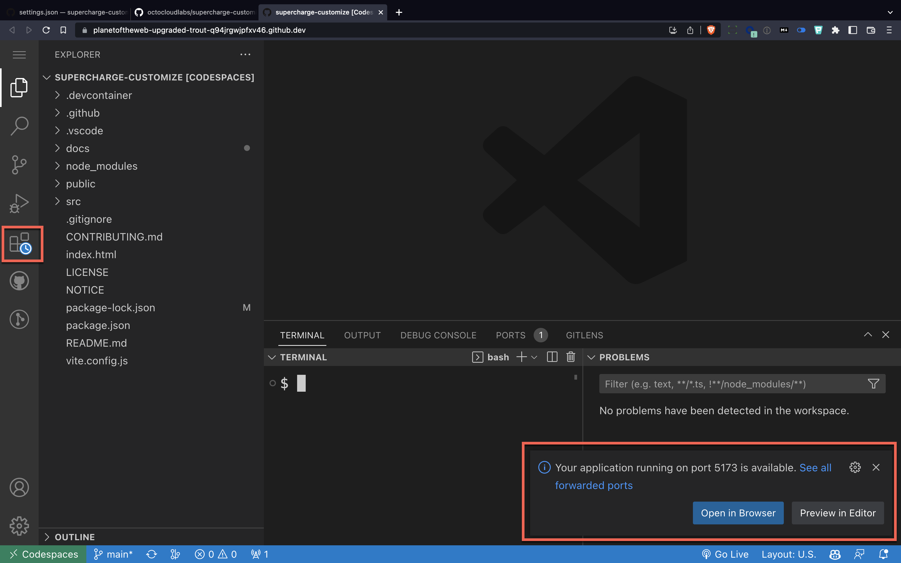

# Customizing Your Codespace

In this section, you'll be learning how to customize your workspace to your needs, you'll also learn a little about the structure of how we create our own courses and how to use a great tool called [CodeTour]( https://marketplace.visualstudio.com/items?itemName=vsls-contrib.codetour).

---

## Our Settings

 
1. Make sure you open the repository for this section called [supercharge-customize](https://github.com/octocloudlabs/supercharge-customize).
1. Click on the green code button
1. Click on the plus icon to create a codespace in the main branch.

## Warnings

**note**: It might take a while for the codespace to open. A lot of times it's because extensions have to be loaded, so keep an eye out for the clock icon as well as small popups, which you can safely ignore.

---

## Take a Look Around

First, it might not look like your current installation of Visual Studio Code. The theme might be different, the font sizes might be larger. 

You might also notice some extra extensions have been loaded. If you look carefully at the terminal prompt, it's been modified to be shorter.

Try it:

- 