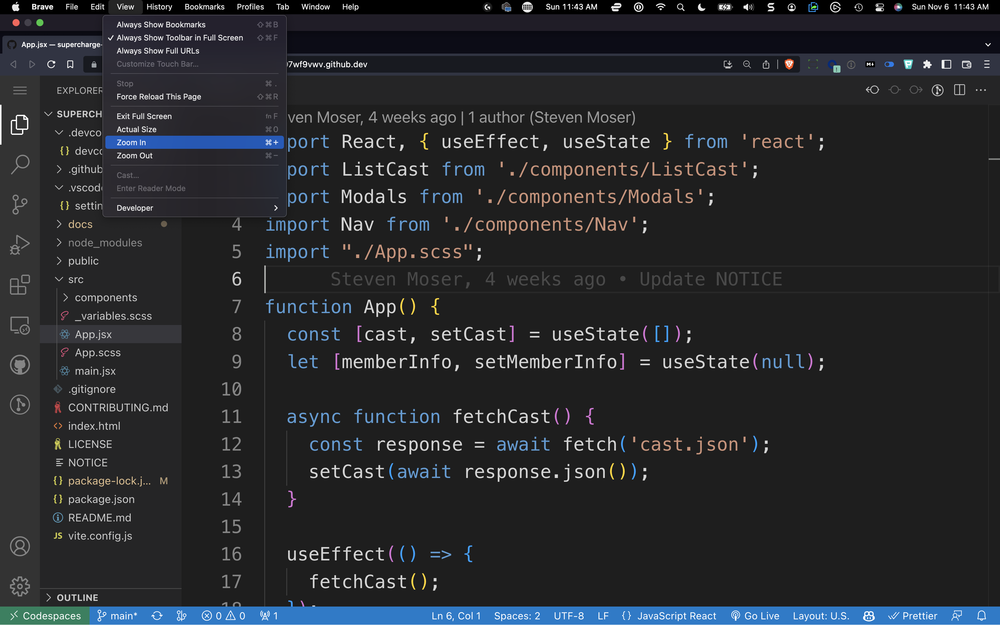

# How we Structure Repositories for Training

LinkedIn Learning Instructors deliberately modify the appearance of GitHub Codespaces to make the recording and playback experience more consistent.

---

## Zoom Ratio

Visual Studio Code has no way of controlling the size of the text in the primary bar (normally your file list), so LinkedIn has standardized on about 140% with your browser zoom controls.

Although that seems like a very large size for everything, it displays well on laptops and smaller screens for watching videos.

---

## Resolution

We generally record in HD (1920x1080) and try to use monitors with 2x density, so technically we can get a max 4k resolution in the recording to improve clarity and allow for zooming in if necessary. 

The font size and other settings in the `.vscode/settings.json` file are adjusted for these proportions.

Whatever you do, make sure the fonts are easy to read, even on a smaller screen.

[Go to next lab section](/ray/lab-3.html)