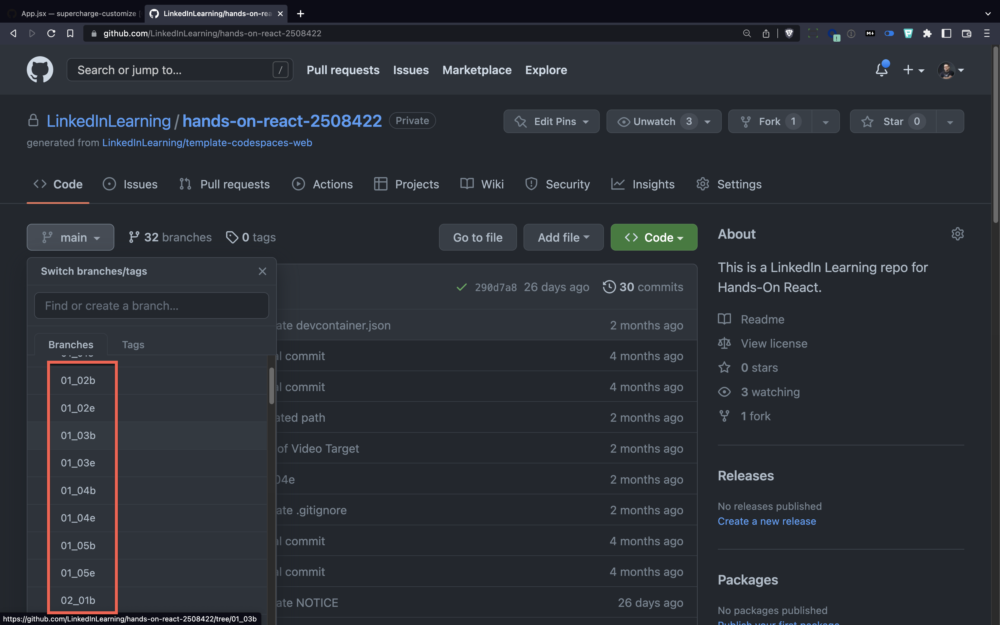
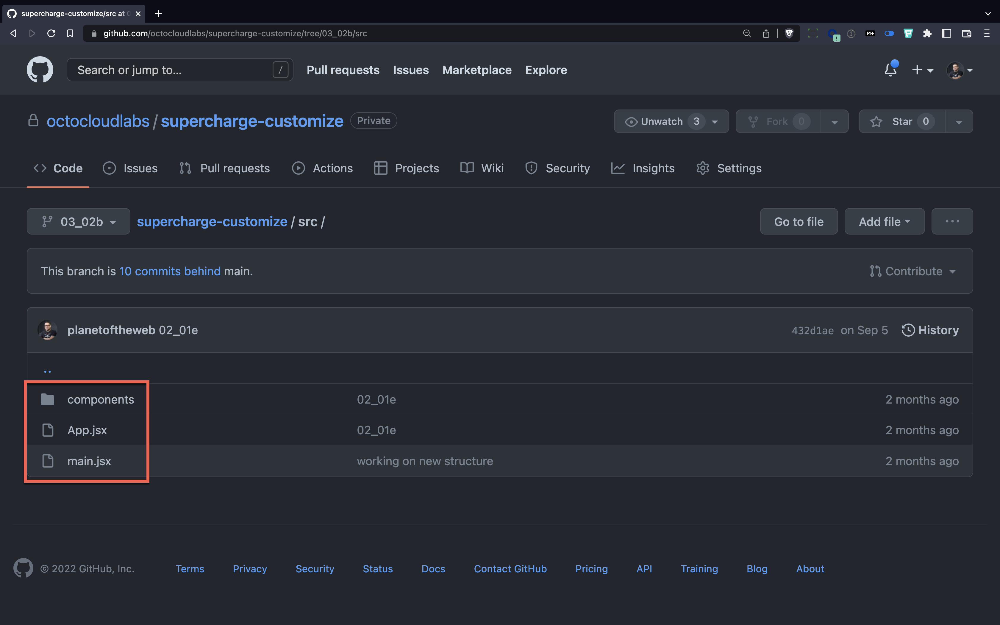
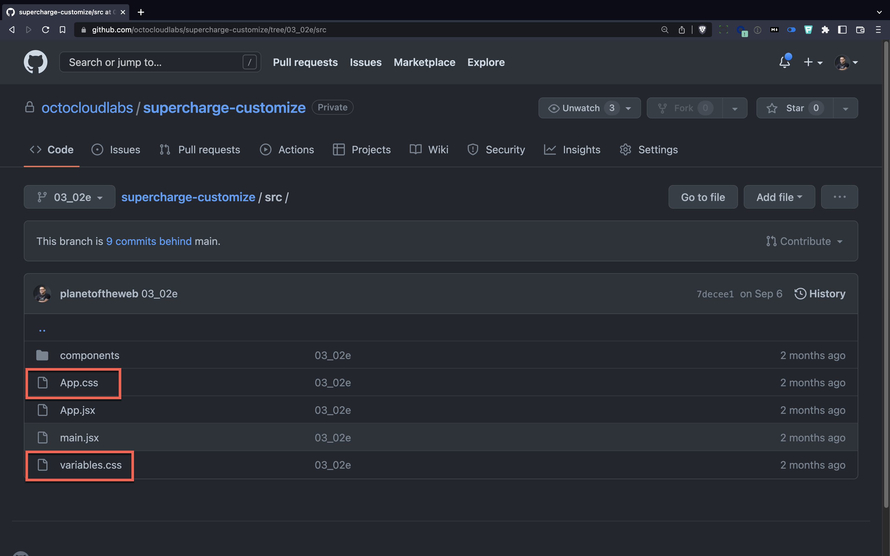
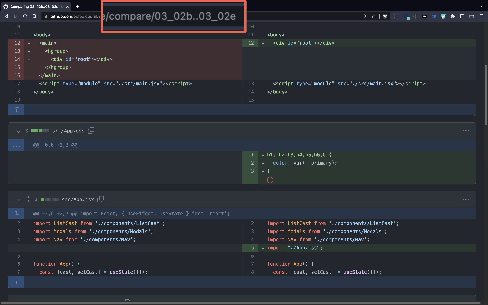
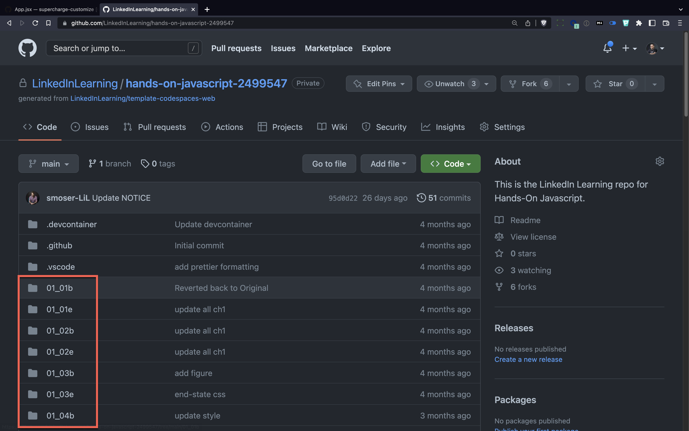

# Understanding Repository Structures

When you're creating content, it's useful to establish a naming convention that lets the user know what state the code in is for each video. We find that using branches in a non-traditional way helps us keep things organized. It allows the learner to drop into any stage of the course.

---

## Multi-branch Repositories

For sites that use build processes, like a lot of web projects, we use one or two branches for each video in the course. We name our branches according to the chapter and the video number in the course.

So, for example, if you find a branch called `01_03`, that branch would correspond to the first chapter and the third video in that chapter.

If you see a `b` at the end of a branch name (as in `01_03b`), that's how the code looks at the beginning of the video. If you see an `e` (as in `01_03e`) at the end, that's how the code looked at the end of the video.

### Exercise

1. Go to the LinkedIn Learning [hands-on-react](https://github.com/LinkedInLearning/hands-on-react-2508422) repository 
1. Click on the branch popup
1. Look at the branches
1. Switch to the `03_02b` branch.
1. Switch to the [src](https://github.com/octocloudlabs/supercharge-customize/tree/03_02b/src) folder.

1. Now switch to the `03_02e` branch.

1. Notice that now there are a few extra CSS files.

💡 **Instructor tip:**

Github has a built in diff tool that's part of the pull request feature, but you can use it to compare branches by adding `/compare/BRANCH01..BRANCH02` to the end of the URL. [Click here to see an example](https://github.com/octocloudlabs/supercharge-customize/compare/03_02b..03_02e). This is useful when you're trying to show students what you're changing between two states.

---

## Flat File Repositories

With a flat file repository, all the files are in a single branch, and there are folders for each video in the courses. This works great for simple projects and languages where a flat file system makes it easier to navigate through a project.

You can see a sample of one of our [flat file](https://github.com/LinkedInLearning/hands-on-javascript-2499547) course in Hands On: JavaScript.

### Exercise
1. Go to the **[hands-on-javascript](https://github.com/LinkedInLearning/hands-on-javascript-2499547)** repository 
1. Look at file list
1. Scroll and open the [02_03b](https://github.com/LinkedInLearning/hands-on-javascript-2499547/tree/main/02_03b) folder

[Go to next lab section](/ray/lab-4.html)