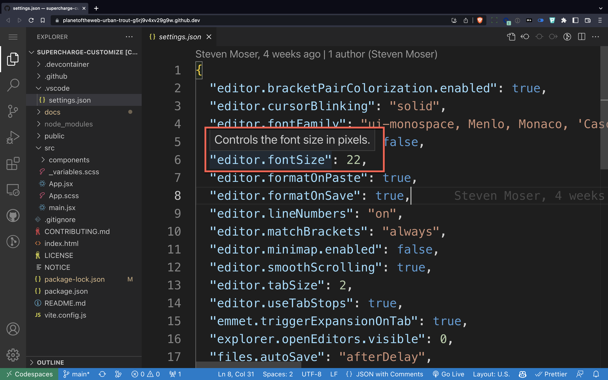
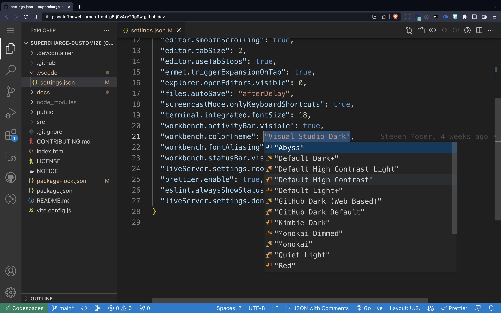
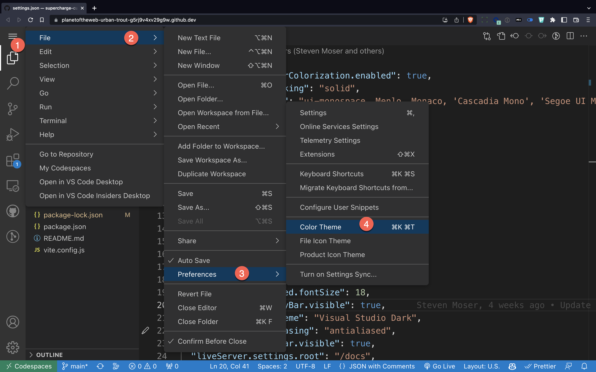
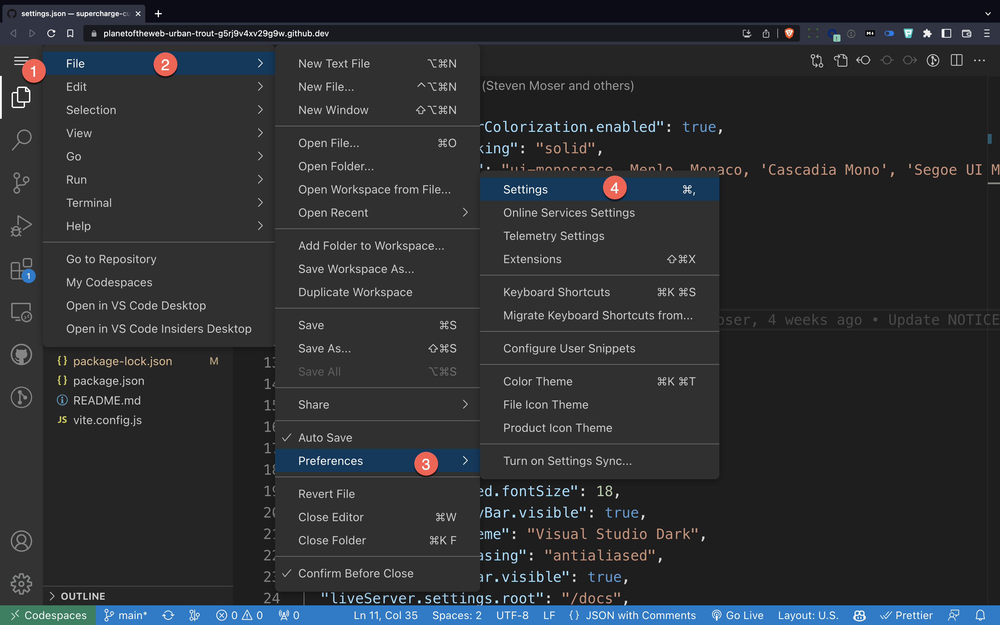
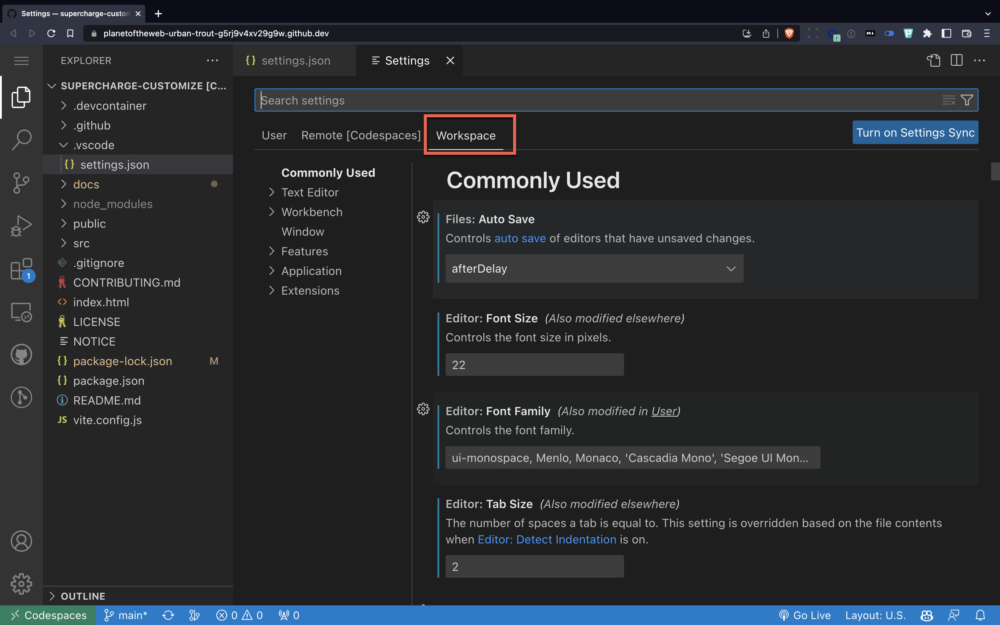

# Modifying Settings

For your own projects, you'll want to create your own look and feel so that your training feels consistent and are as readable as possible.

To make sure that the learner's computer matches your training, you can define settings to be on by default, so for example you can make sure line numbers are turned on, the minimap is off and that the activity bar is showing.

If there's already a `settings.json` file in the `.vscode` folder, you can modify it to your liking. Let's try changing an existing file.

---

## Modifying the Settings

To make your codespace look a certain way, you can customize the `.vscode/settings.json` file. Let's try modifying the font size file for our codespace.



1. Open your codespace
1. Navigate to `.vscode/settings.json`
1. Find the line `"editor.fontSize": 22`
1. Change the value to `16`

It takes a second for the font to update. If you roll over the value on the JSON file, you'll get a description of what the setting does.

---

## Letting IntelliSense Help



If you want to modify a setting, but you're not sure what the options are, you can let intellisense help you.

### Exercise
1. Select `"Visual Studio Dark"` including the quotes
1. Type `ctrl + space` to bring up IntelliSense
1. Choose another theme from the list

---

## By Modifying Menus

Sometimes, it's better to just modify the settings using the menus.



By changing the color theme here, notice that it changes the active workspace settings and the workspace file as well.

---

## From Settings Menu



If you don't know the name of a setting, you can find them in the settings menu.



By doing this, you can have fine grained control over which version of the settings you're going to modify. By clicking on the workspace tab, you'll be affecting just this workspace, not your settings for other projects.

---

## Guaranteeing Settings

Settings will often be overriden by the user's own options, so sometimes you want to make sure a setting is turned on, even though the user might have turned it off.

`"workbench.activityBar.visible": true,`

Such is the case with the activity bar. I often try to save a few pixels while I'm  coding, so for me the activity bar is off normally, but when I record, I want to make sure it's on.


## Default Settings

Just in case you're wondering, here's what the [default settings](https://code.visualstudio.com/docs/getstarted/settings#_default-settings) for Visual Studio look like.


## Settings Documentation

To learn more about settings, check out the VS Code [online documentation](https://code.visualstudio.com/docs/getstarted/settings)

## Our Defaults

After some deliberation, here are our default settings for future reference.

```json
{
  "editor.bracketPairColorization.enabled": true,
  "editor.cursorBlinking": "solid",
  "editor.fontFamily": "ui-monospace, Menlo, Monaco, 'Cascadia Mono', 'Segoe UI Mono', 'Roboto Mono', 'Oxygen Mono', 'Ubuntu Monospace', 'Source Code Pro', 'Fira Mono', 'Droid Sans Mono', 'Courier New', monospace",
  "editor.fontLigatures": false,
  "editor.fontSize": 22,
  "editor.formatOnPaste": true,
  "editor.formatOnSave": true,
  "editor.lineNumbers": "on",
  "editor.matchBrackets": "always",
  "editor.minimap.enabled": false,
  "editor.smoothScrolling": true,
  "editor.tabSize": 2,
  "editor.useTabStops": true,
  "emmet.triggerExpansionOnTab": true,
  "explorer.openEditors.visible": 0,
  "files.autoSave": "afterDelay",
  "screencastMode.onlyKeyboardShortcuts": true,
  "terminal.integrated.fontSize": 18,
  "workbench.activityBar.visible": true,
  "workbench.colorTheme": "Visual Studio Dark",
  "workbench.fontAliasing": "antialiased",
  "workbench.statusBar.visible": true,
  "liveServer.settings.root": "/docs",
  "prettier.enable": true,
  "eslint.alwaysShowStatus": false,
  "liveServer.settings.donotVerifyTags": true
}
```

[Go to next lab section](/ray/lab-5.html)