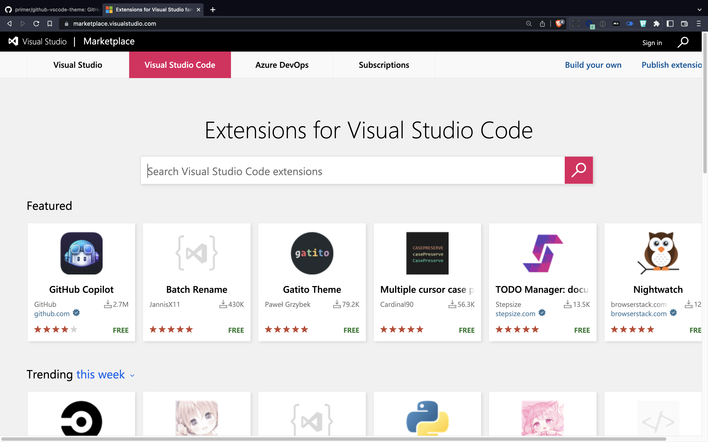
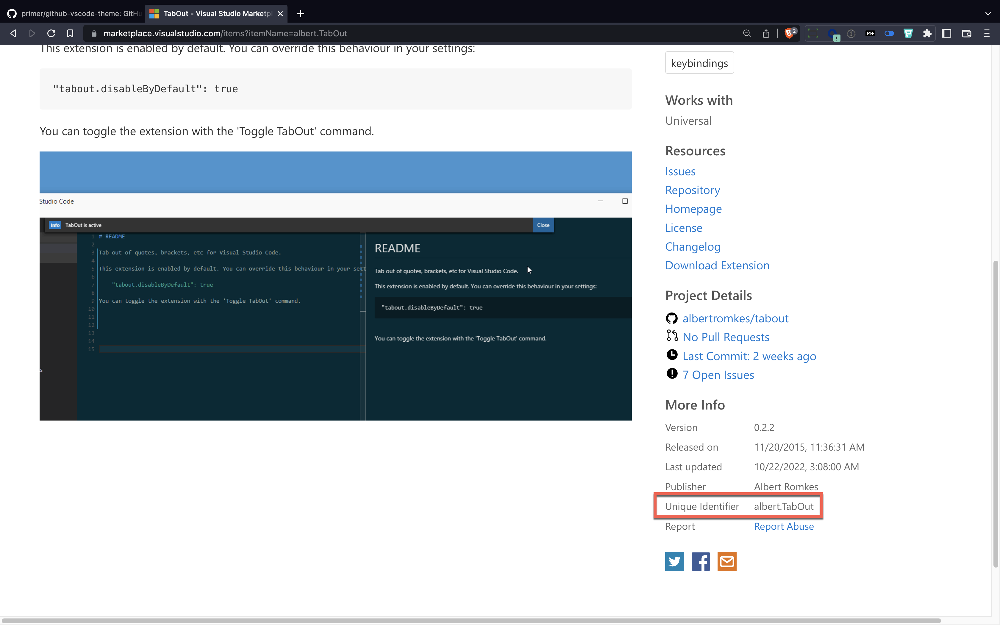
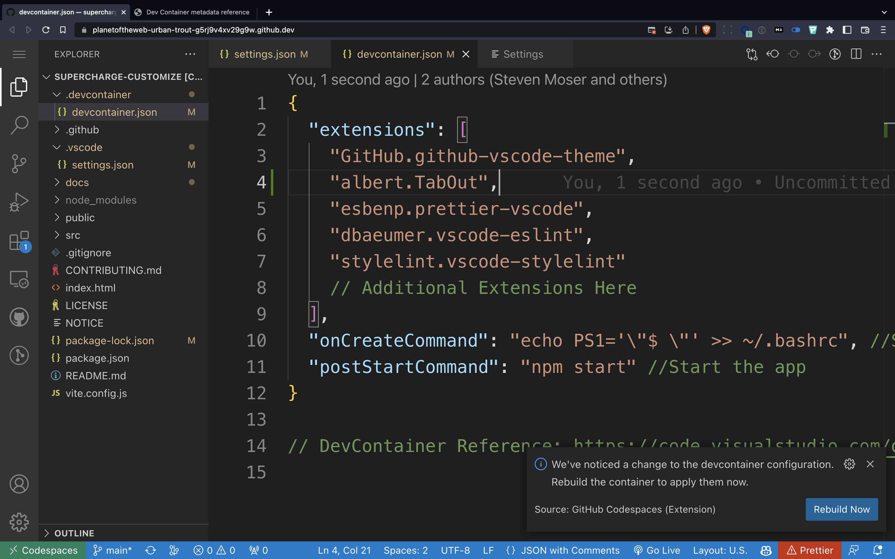
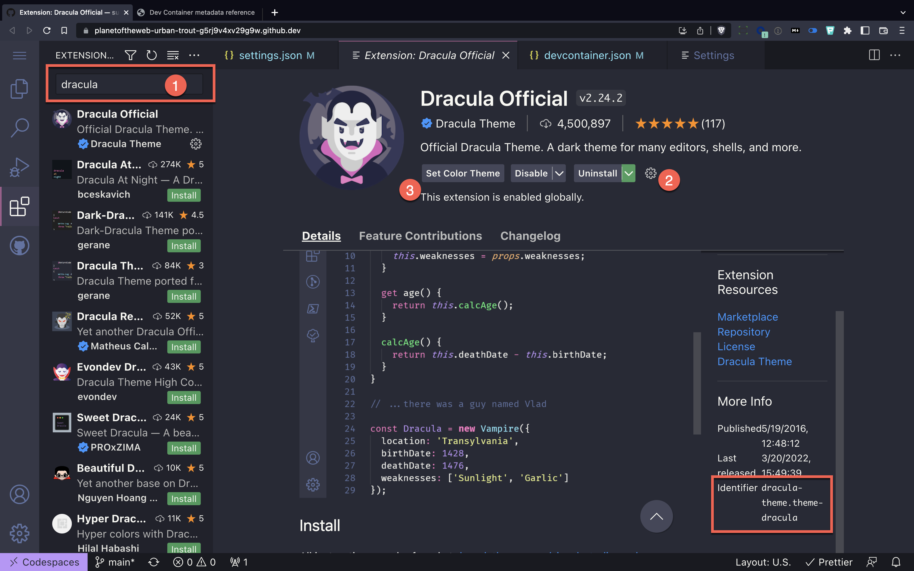
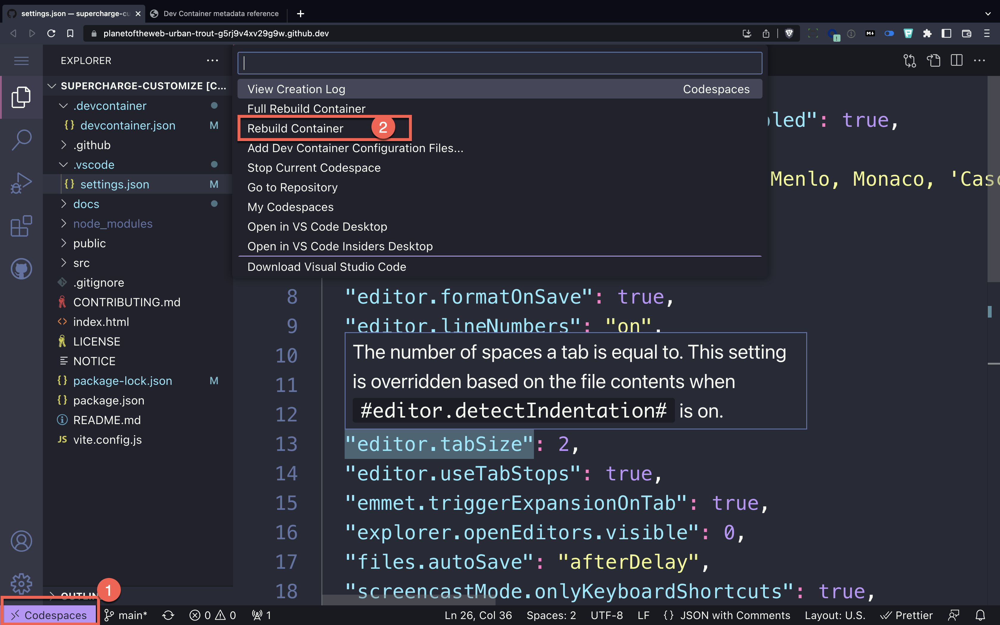
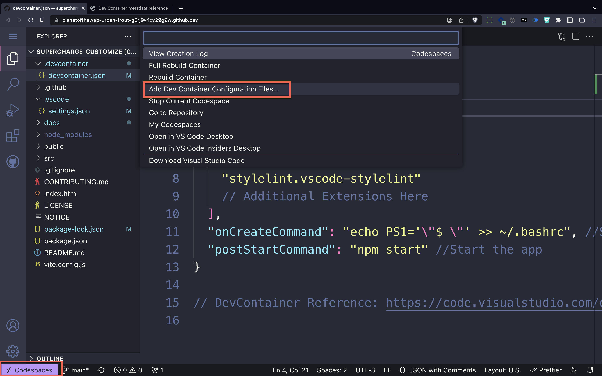

# Devcontainers

The second way we modify our codespaces is through the use of a `.devcontainer/devcontainer.json` file.

This file lets you control how your environment works. It can get quite complicated and be very extensive.

## Exercise

1. Make sure you're in the [supercharge-customize](https://github.com/octocloudlabs/supercharge-customize) repository and that your codespace is open.
1. Locate the `.devcontainer/devcontainer.json` file.

---

## What We Change

Our setup is pretty simple, we want to control three things.

- Which extensions are installed in a workspace through the `"extensions": []` array
- Manually modify the command prompt to make it shorter during the recording `"onCreateCommand"`
- Optionally launch the npm start command when the codespace is created `"postStartCommand"`

## Finding the Unique Identifier

The best place to find extensions is the VSCode Marketplace.

Exercise
1. Go to the [VSCode Marketplace](https://marketplace.visualstudio.com/vscode)
1. Type in tabout in the search
1. Click on the first result
1. Scroll down to the Unique Identifier under More Info
1. Copy the unique identifier
1. Paste into the extensions array.

Whenever you modify the devcontainer.json file, Codespaces will ask if you want to rebuild the container. If you're not done making changes, you can ignore or close the notification.

After the container is rebuilt, place your cursor inside one of the double quotes in the devcontainer.json file and hit tab.

The tabout extensions simply lets you tab out of quotes. Simple, but pretty handy.

## Using the Extensions Panel

You can also use the extensions panel to get the unique identifier. 

### Exercise

1. Open the extensions panel
1. Search for Dracula
1. Click on the Dracula Official theme
1. Click on Install
1. Click on the "Set Color Theme" button
1. Scroll down and look for the unique identifier
1. Switch back to the `devcontainer.json` file
1. Paste the unique identifier into the extensions array

In order for the theme to be automatically loaded with your project, the extension must be installed, the theme must be set and the unique identifier must be in the extensions array.

## Rebuilding the Container

If you have closed out of the rebuild message, but still want to rebuild the container

1. Click on the codespaces button at the bottom left of the screen
1. Choose rebuild container

---

## Devcontainer Walkthrough

You can also have Codespaces suggest a devcontainer.json file for you with some settings. The community has created a lot of these files for you to use.

Alpine, for example is a very small Linux distribution. It's very fast and lightweight. It's also very popular in the Docker community.

1. Click on the codespaces button at the bottom left of the screen
1. Choose "Add DevContainer Configuration Files..."
1. Choose Alpine
1. Choose a Version
1. Add options
1. Allow overrite

You can take a peek at what was installed and undo the changes if you don't like them.

---

## More Info

Here's the [full documentation](https://code.visualstudio.com/docs/remote/devcontainerjson-reference) for what you can modify.

---

## Practice
In the next session, we're going to be working with an extension called Code Tours. Try installing the extension by yourself.